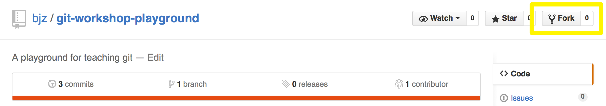
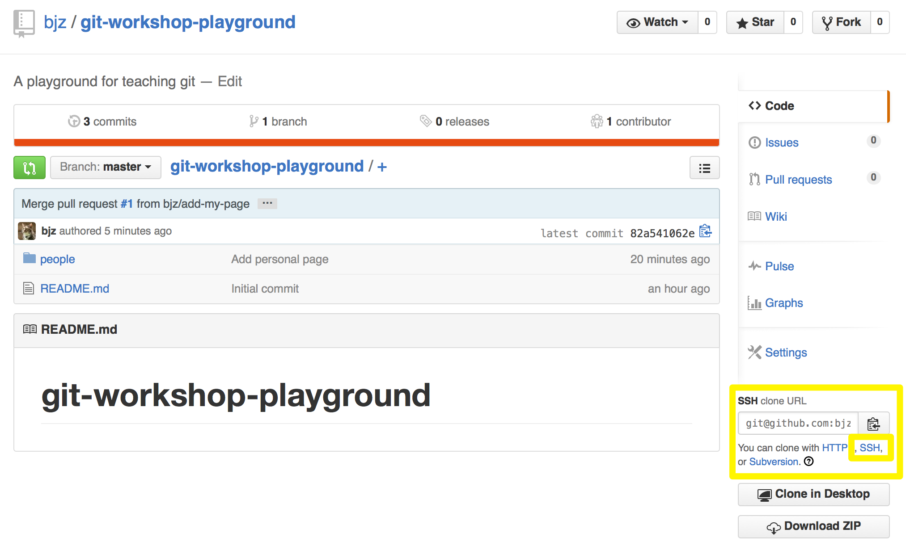
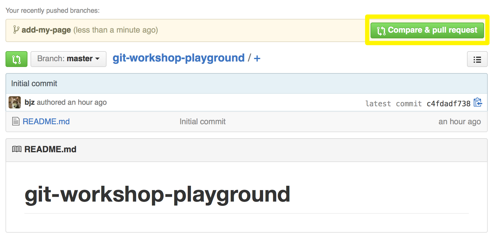

# git-workshop-playground

Press the fork button:



Copy the SSH clone url (you'll need to click the SSH link before copying):



In your terminal/command line, run:

```sh
git clone URL               # Where `URL` is the link you just copied
cd git-workshop-playground
```

Make a new branch:

```
git checkout -b add-my-page
```

Create your own html file:

```
subl people/USERNAME.html
```

You can see some examples already in [the people directory](https://github.com/bjz/git-workshop-playground/blob/master/people)

Now stage your changes in the working directory, and commit:

```
git add people/USERNAME.html
git commit -m "Add personal page"
```

Push to a new branch on your repository:

```
git push -u origin add-my-page
```

Now make a new pull request to the main repository. There should be a handy link on [bjz/git-workshop-playground](https://github.com/bjz/git-workshop-playground):


